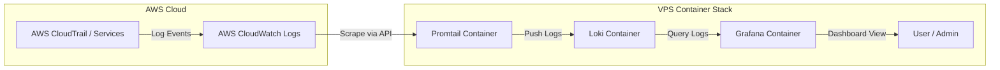

# AWS CloudWatch & CloudTrail Logs Monitoring with Loki & Grafana

A lightweight, production-ready monitoring stack using **Grafana**, **Loki**, and **Promtail** to collect, aggregate, and visualize AWS CloudWatch and CloudTrail logs on a Virtual Private Server (VPS).

---

## 📌 Overview

This project provides an automated Docker Compose deployment for shipping logs from AWS CloudWatch (including CloudTrail events forwarded to CloudWatch) directly into a local Loki log aggregation instance and visualizing them using Grafana.

### 🏗 Architecture



---

## 🚀 Key Features

* **CloudWatch Integration**: Automatically scrapes AWS CloudWatch Log Groups using Promtail.
* **Cost-Efficient Storage**: Loki indexes metadata labels rather than full log text, minimizing storage overhead.
* **30-Day Log Retention**: Pre-configured automated compactor and retention policies.
* **Grafana Dashboards**: Real-time log exploration and visualization with LogQL.
* **Containerized Deployment**: One-command setup using Docker Compose.

---

## 📋 Prerequisites

Before deploying on your VPS, ensure you have:

1. **VPS Server**: Ubuntu 20.04/22.04/24.04 LTS (or any Linux distro with Docker support). Recommended minimum: 2 vCPU, 2GB RAM.
2. **Docker & Docker Compose**: Installed on your VPS.
3. **AWS IAM User Credentials**: An IAM user with read permissions to your AWS CloudWatch log groups.

### 🔑 Required AWS IAM Permissions Policy

Attach the following IAM policy (or similar minimal read permissions) to the AWS user generating the access keys:

```json
{
    "Version": "2012-10-17",
    "Statement": [
        {
            "Effect": "Allow",
            "Action": [
                "logs:DescribeLogGroups",
                "logs:DescribeLogStreams",
                "logs:GetLogEvents",
                "logs:FilterLogEvents"
            ],
            "Resource": "*"
        }
    ]
}
```

---

## ⚙️ Configuration

### 1. Environment Variables (`.env`)

Copy the `.env.example` template to create your `.env` file:

```bash
cp .env.example .env
```

Edit `.env` with your actual credentials and settings:

```env
# AWS Credentials for Promtail CloudWatch Access
AWS_ACCESS_KEY_ID=your_actual_aws_access_key
AWS_SECRET_ACCESS_KEY=your_actual_aws_secret_key
AWS_REGION=us-east-1

# Grafana Admin Credentials
GF_ADMIN_USER=admin
GF_ADMIN_PASSWORD=your_secure_password_here
```

### 2. Promtail Log Group Configuration (`promtail-config.yaml`)

Open `promtail-config.yaml` and configure the CloudWatch Log Groups you want to scrape:

```yaml
scrape_configs:
  - job_name: cloudwatch
    cloudwatch:
      region: ${AWS_REGION}
      log_group_names:
        - /aws/cloudtrail/my-trail-logs   # Add your CloudTrail log group
        - /aws/ec2/your-instance-logs     # Add any other log groups
      poll_interval: 30s
      labels:
        job: "aws-logs"
        environment: "production"
```

---

## 🌐 How to Run on a VPS (Step-by-Step)

### Step 1: Connect to your VPS
```bash
ssh user@your_vps_ip
```

### Step 2: Install Docker & Docker Compose (if not already installed)
On Ubuntu/Debian:
```bash
sudo apt update
sudo apt install -y docker.io docker-compose-plugin
sudo systemctl enable --now docker
```

### Step 3: Clone or Upload Project Files
Clone your repository or upload the project directory to your server:
```bash
git clone <your-repository-url>
cd aws-watch-cloudtrails-loki-grafana
```

### Step 4: Set Up Environment Variables & Configs
```bash
cp .env.example .env
nano .env                  # Set your AWS keys & Grafana password
nano promtail-config.yaml   # Set your CloudWatch log group names
```

### Step 5: Launch the Stack
Start all services in detached mode:
```bash
docker compose up -d
```

Verify that all containers are running properly:
```bash
docker compose ps
```

---

## 📊 Accessing Grafana & Connecting Loki

1. Open your web browser and navigate to:
   ```text
   http://<YOUR_VPS_IP>:3000
   ```
2. Log in with the credentials configured in your `.env` file (`GF_ADMIN_USER` and `GF_ADMIN_PASSWORD`).
3. **Add Loki as a Data Source**:
   * Navigate to **Connections** > **Data Sources** > **Add data source**.
   * Select **Loki**.
   * Set the URL to: `http://loki:3100` (uses internal Docker DNS).
   * Click **Save & test**. You should see a green success notification.
4. **Explore Logs**:
   * Go to the **Explore** tab in Grafana.
   * Select **Loki** as the data source.
   * Use LogQL queries like `{job="aws-logs"}` or `{source="aws-cloudwatch"}` to inspect live log streams.

---

## 🔒 Production Security Best Practices

### 1. Configure VPS Firewall (UFW)
Never expose internal services publicly. Only expose Grafana (port 3000) or restrict access to specific IP addresses:

```bash
sudo ufw allow 22/tcp          # SSH
sudo ufw allow 3000/tcp        # Grafana
sudo ufw enable
```

### 2. Set Up Nginx Reverse Proxy with SSL (HTTPS)
For production environments, place Grafana behind an Nginx reverse proxy with Let's Encrypt SSL certificate:

```nginx
server {
    server_name monitoring.yourdomain.com;

    location / {
        proxy_pass http://localhost:3000;
        proxy_set_header Host $host;
        proxy_set_header X-Real-IP $remote_addr;
        proxy_set_header X-Forwarded-For $proxy_add_x_forwarded_for;
        proxy_set_header X-Forwarded-Proto $scheme;
    }
}
```

---

## 🛠 Useful Maintenance Commands

| Action | Command |
| :--- | :--- |
| **View Service Status** | `docker compose ps` |
| **View All Container Logs** | `docker compose logs -f` |
| **View Specific Service Logs** | `docker compose logs -f promtail` |
| **Restart Services** | `docker compose restart` |
| **Stop Stack** | `docker compose down` |
| **Stop Stack & Delete Volumes** | `docker compose down -v` |

---

## 📄 License

This project is licensed under the MIT License.
